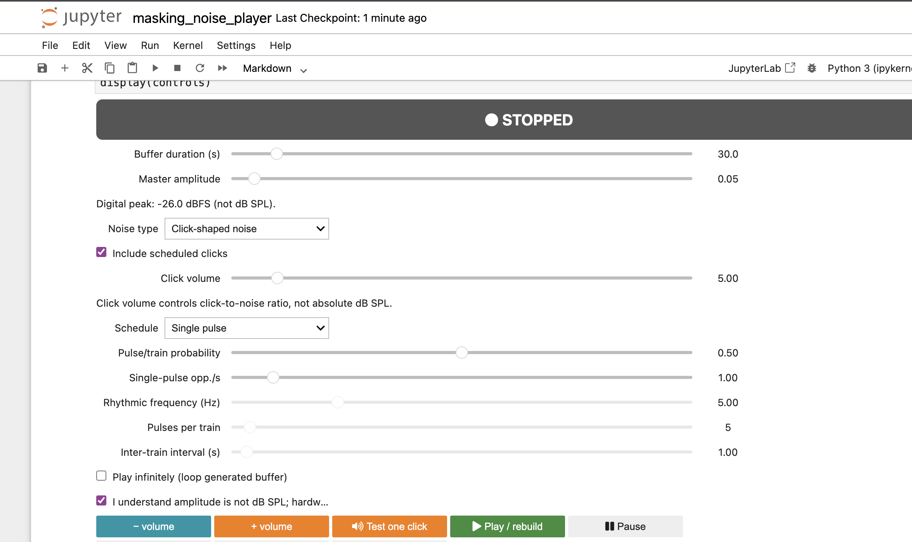

# CAMpy-TMS

Interactive Jupyter notebook for creating and playing TMS auditory masking noise
with optional probabilistic single clicks or rhythmic click trains.

Open `masking_noise_player.ipynb` and run it from top to bottom. The notebook uses
the recorded single pulse in `assets/` and writes previews and settings to
`generated/`.

The experimental TAAC reproduction is kept separately under `in progress/`.

Digital volume is not calibrated dB SPL. Start at low hardware volume and validate
the complete headphone and masking setup before participant use.
